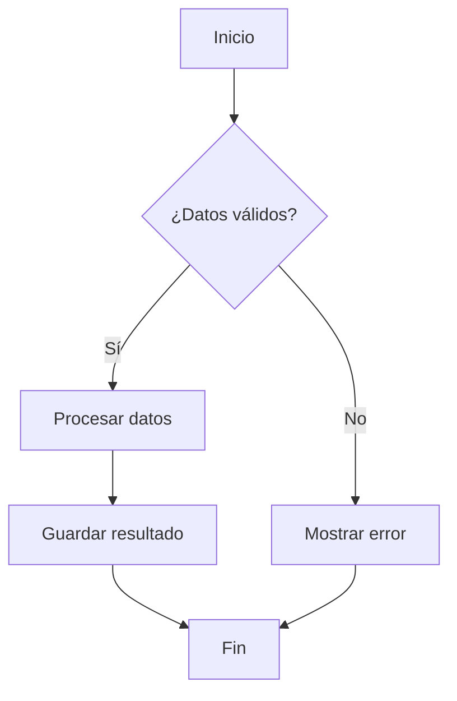
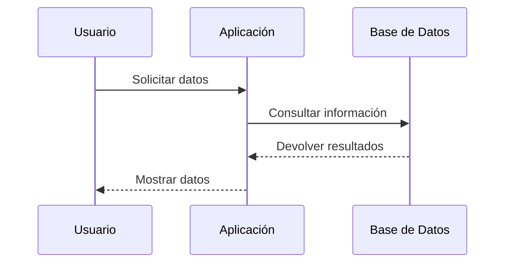
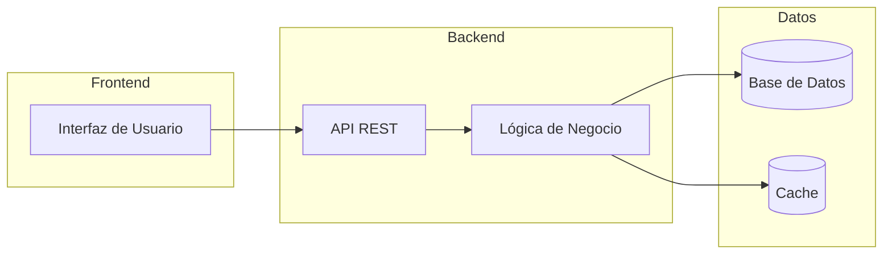

# Buenas Prácticas de MkDocs Material

## 1. **Configuración Inicial y Estructura**

### 1.1 Configuración Básica del mkdocs.yml
```yaml
# ✅ Configuración básica recomendada
site_name: Mi Proyecto de Documentación
site_url: https://mi-proyecto.github.io/docs/
site_author: Tu Nombre
site_description: >-
  Descripción completa y clara del proyecto que aparecerá 
  en meta tags y motores de búsqueda

repo_name: usuario/repositorio
repo_url: https://github.com/usuario/repositorio

# ✅ Configuración del tema Material
theme:
  name: material
  language: es
  palette:
    # Palette toggle for automatic mode
    - media: "(prefers-color-scheme)"
      toggle:
        icon: material/brightness-auto
        name: Switch to light mode
    # Palette toggle for light mode
    - media: "(prefers-color-scheme: light)"
      scheme: default
      primary: indigo
      accent: indigo
      toggle:
        icon: material/brightness-7
        name: Switch to dark mode
    # Palette toggle for dark mode
    - media: "(prefers-color-scheme: dark)"
      scheme: slate
      primary: indigo
      accent: indigo
      toggle:
        icon: material/brightness-4
        name: Switch to system preference

  font:
    text: Roboto
    code: Roboto Mono

  favicon: assets/favicon.png
  logo: assets/logo.png

# ❌ Evita configuraciones demasiado complejas inicialmente
```

### 1.2 Estructura de Directorios
```
proyecto-docs/
├── mkdocs.yml                 # ✅ Configuración principal
├── docs/                      # ✅ Contenido de documentación
│   ├── index.md              # ✅ Página de inicio
│   ├── getting-started/       # ✅ Secciones organizadas
│   │   ├── installation.md
│   │   └── quick-start.md
│   ├── user-guide/
│   │   ├── basics.md
│   │   └── advanced.md
│   ├── api/
│   │   └── reference.md
│   ├── assets/               # ✅ Recursos estáticos
│   │   ├── images/
│   │   ├── css/
│   │   └── js/
│   └── stylesheets/          # ✅ CSS personalizado
│       └── extra.css
├── requirements.txt          # ✅ Dependencias de Python
└── .github/                  # ✅ CI/CD workflows
    └── workflows/
        └── docs.yml
```

### 1.3 Navegación Estructurada
```yaml
# ✅ Navegación bien organizada
nav:
  - Inicio: index.md
  - Primeros Pasos:
    - Instalación: getting-started/installation.md
    - Inicio Rápido: getting-started/quick-start.md
  - Guía del Usuario:
    - Conceptos Básicos: user-guide/basics.md
    - Funciones Avanzadas: user-guide/advanced.md
  - Referencia API:
    - Documentación API: api/reference.md
  - Contribuir:
    - Guía de Contribución: contributing.md
    - Código de Conducta: code-of-conduct.md

# ❌ Evita navegaciones planas sin estructura
nav:
  - index.md
  - installation.md
  - basics.md
  - advanced.md
  - api.md
```

## 2. **Características y Extensiones**

### 2.1 Extensiones Esenciales
```yaml
# ✅ Extensiones recomendadas
markdown_extensions:
  # Extensiones de Python-Markdown
  - abbr
  - admonition
  - attr_list
  - def_list
  - footnotes
  - md_in_html
  - toc:
      permalink: true
      title: "Contenido de esta página"
  - tables

  # Extensiones de PyMdown
  - pymdownx.arithmatex:
      generic: true
  - pymdownx.betterem:
      smart_enable: all
  - pymdownx.caret
  - pymdownx.details
  - pymdownx.emoji:
      emoji_generator: !!python/name:materialx.emoji.to_svg
      emoji_index: !!python/name:materialx.emoji.twemoji
  - pymdownx.highlight:
      anchor_linenums: true
      line_spans: __span
      pygments_lang_class: true
  - pymdownx.inlinehilite
  - pymdownx.keys
  - pymdownx.magiclink:
      normalize_issue_symbols: true
      repo_url_shorthand: true
      user: usuario
      repo: repositorio
  - pymdownx.mark
  - pymdownx.smartsymbols
  - pymdownx.snippets:
      check_paths: true
  - pymdownx.superfences:
      custom_fences:
        - name: mermaid
          class: mermaid
          format: !!python/name:pymdownx.superfences.fence_code_format
  - pymdownx.tabbed:
      alternate_style: true
  - pymdownx.tasklist:
      custom_checkbox: true
  - pymdownx.tilde
```

### 2.2 Plugins Útiles
```yaml
# ✅ Plugins recomendados
plugins:
  - search:
      lang:
        - es
        - en
  - minify:
      minify_html: true
  - git-revision-date-localized:
      type: datetime
      locale: es
  - git-authors
  - autolinks
  - awesome-pages
  - macros:
      include_dir: docs/includes
  - redirects:
      redirect_maps:
        'old-page.md': 'new-page.md'
  - social:
      cards_layout_options:
        color: "#2094f3"

# ✅ Plugin para generar sitemap
  - sitemap:
      format: xml
      priority_file: sitemap_priority.txt
```

### 2.3 Configuración de Características del Tema
```yaml
# ✅ Características del tema habilitadas
theme:
  name: material
  features:
    - announce.dismiss
    - content.action.edit
    - content.action.view
    - content.code.annotate
    - content.code.copy
    - content.tabs.link
    - content.tooltips
    - header.autohide
    - navigation.expand
    - navigation.footer
    - navigation.indexes
    - navigation.instant
    - navigation.instant.prefetch
    - navigation.instant.progress
    - navigation.path
    - navigation.prune
    - navigation.sections
    - navigation.tabs
    - navigation.tabs.sticky
    - navigation.top
    - navigation.tracking
    - search.highlight
    - search.share
    - search.suggest
    - toc.follow
    - toc.integrate

# ⚠️ No habilites todas las características a la vez sin probar
```

## 3. **Contenido y Escritura**

### 3.1 Página de Inicio Efectiva
```markdown
# ✅ Página de inicio bien estructurada
# Bienvenido a [Nombre del Proyecto]

[Descripción breve y atractiva del proyecto en 1-2 líneas]

## ¿Qué es [Nombre del Proyecto]?

Descripción más detallada del propósito y funcionalidad.

## Características Principales

=== "Característica 1"
    
    Descripción de la primera característica principal.
    
    ```python
    # Ejemplo de código
    ejemplo.funcion()
    ```

=== "Característica 2"
    
    Descripción de la segunda característica.

=== "Característica 3"
    
    Descripción de la tercera característica.

## Inicio Rápido

!!! tip "Instalación Rápida"
    
    ```bash
    pip install mi-proyecto
    ```

1. **Instalar el paquete**
   ```bash
   pip install mi-proyecto
   ```

2. **Configurar el proyecto**
   ```python
   import mi_proyecto
   mi_proyecto.configurar()
   ```

3. **¡Listo para usar!**
   ```python
   mi_proyecto.ejecutar()
   ```

## ¿Por dónde empezar?

<div class="grid cards" markdown>

-   :material-clock-fast:{ .lg .middle } **Inicio Rápido**

    ---

    Comienza en minutos con nuestro tutorial paso a paso

    [:octicons-arrow-right-24: Empezar](getting-started/installation.md)

-   :material-book-open-page-variant:{ .lg .middle } **Guía del Usuario**

    ---

    Aprende todas las funcionalidades disponibles

    [:octicons-arrow-right-24: Explorar](user-guide/basics.md)

-   :material-api:{ .lg .middle } **Referencia API**

    ---

    Documentación técnica completa de la API

    [:octicons-arrow-right-24: API](api/reference.md)

-   :material-account-group:{ .lg .middle } **Comunidad**

    ---

    Únete a nuestra comunidad de desarrolladores

    [:octicons-arrow-right-24: GitHub](https://github.com/usuario/repo)

</div>
```

### 3.2 Uso Efectivo de Admonitions
```markdown
# ✅ Admonitions bien utilizadas

!!! note "Información Importante"
    Esta es información que el usuario debe conocer.

!!! tip "Consejo Útil"
    Este consejo te ayudará a ser más eficiente.

!!! warning "Advertencia"
    Ten cuidado con esta configuración.

!!! danger "Peligro"
    Esta acción puede causar pérdida de datos.

!!! example "Ejemplo Práctico"
    ```python
    def ejemplo():
        return "Hello World"
    ```

!!! quote "Cita Relevante"
    "La documentación es amor por tu futuro yo" - Autor

# ✅ Admonitions colapsables
??? info "Información Adicional"
    Esta información se puede expandir cuando sea necesaria.

??? faq "Preguntas Frecuentes"
    **P: ¿Cómo instalo el paquete?**
    
    R: Usa `pip install mi-paquete`
    
    **P: ¿Es compatible con Python 3.9?**
    
    R: Sí, es compatible con Python 3.8+

# ❌ Evita sobreuso de admonitions
!!! note
    Nota 1
!!! tip  
    Consejo 1
!!! warning
    Advertencia 1
!!! note
    Nota 2
```

### 3.3 Código y Ejemplos
```markdown
# ✅ Bloques de código con anotaciones
```python
def procesar_datos(datos): # (1)!
    """
    Procesa una lista de datos y retorna el resultado.
    
    Args:
        datos (list): Lista de datos a procesar
        
    Returns:
        dict: Resultado del procesamiento
    """
    resultado = {}
    
    for item in datos: # (2)!
        if validar_item(item): # (3)!
            resultado[item.id] = item.procesar()
    
    return resultado
```

1. La función principal que maneja todo el procesamiento
2. Iteramos sobre cada elemento de la lista
3. Validamos antes de procesar para evitar errores

# ✅ Tabs para múltiples lenguajes/opciones
=== "Python"
    
    ```python
    import requests
    
    response = requests.get('https://api.example.com')
    data = response.json()
    ```

=== "JavaScript"
    
    ```javascript
    fetch('https://api.example.com')
      .then(response => response.json())
      .then(data => console.log(data));
    ```

=== "cURL"
    
    ```bash
    curl -X GET https://api.example.com \
         -H "Accept: application/json"
    ```

# ✅ Código con números de línea y resaltado
```python linenums="1" hl_lines="3 6-8"
def main():
    datos = cargar_datos()
    if not datos:  # Línea resaltada
        return
    
    for item in datos:  # Líneas 6-8 resaltadas
        procesar(item)
        guardar(item)
```
```

## 4. **Diseño y Personalización**

### 4.1 CSS Personalizado
```css
/* ✅ docs/stylesheets/extra.css */

/* Personalización de colores */
:root {
  --md-primary-fg-color: #1976d2;
  --md-accent-fg-color: #ff5722;
}

/* Mejoras tipográficas */
.md-typeset h1 {
  font-weight: 300;
  color: var(--md-primary-fg-color);
}

/* Cards personalizadas */
.md-typeset .grid.cards > ol > li,
.md-typeset .grid.cards > ul > li {
  border: 1px solid var(--md-default-fg-color--lightest);
  border-radius: 0.1rem;
  transition: border 250ms, box-shadow 250ms;
}

.md-typeset .grid.cards > ol > li:hover,
.md-typeset .grid.cards > ul > li:hover {
  border-color: var(--md-primary-fg-color);
  box-shadow: 0 0.2rem 0.5rem rgba(0, 0, 0, 0.1);
}

/* Mejoras para código */
.md-typeset code {
  background-color: rgba(var(--md-primary-fg-color--rgb), 0.1);
  color: var(--md-primary-fg-color);
}

/* Personalización de admonitions */
.md-typeset .admonition.note {
  border-color: #448aff;
}

.md-typeset .admonition.note > .admonition-title {
  background-color: rgba(68, 138, 255, 0.1);
}

/* Responsive improvements */
@media screen and (max-width: 76.1875em) {
  .md-nav--primary .md-nav__title {
    background-color: var(--md-primary-fg-color);
  }
}

/* Print styles */
@media print {
  .md-typeset .admonition {
    break-inside: avoid;
  }
}
```

### 4.2 JavaScript Personalizado
```javascript
// ✅ docs/assets/js/extra.js

// Funcionalidad adicional para la documentación
document.addEventListener("DOMContentLoaded", function() {
  
  // Añadir funcionalidad de copia a tablas
  var tables = document.querySelectorAll("table");
  tables.forEach(function(table) {
    // Código para añadir botón de copia
  });
  
  // Analytics personalizados
  if (typeof gtag !== 'undefined') {
    // Tracking de descargas
    document.querySelectorAll('a[href$=".pdf"], a[href$=".zip"]').forEach(function(link) {
      link.addEventListener('click', function() {
        gtag('event', 'download', {
          'file_name': this.href.split('/').pop()
        });
      });
    });
  }
  
  // Mejoras de accesibilidad
  var codeBlocks = document.querySelectorAll('pre code');
  codeBlocks.forEach(function(block) {
    block.setAttribute('tabindex', '0');
  });
});

// Funcionalidad para cambio de tema
function initializeThemeToggle() {
  var palette = __md_get("__palette");
  if (palette && typeof palette.color === "object") {
    for (var key of Object.keys(palette.color)) {
      document.body.setAttribute("data-md-color-" + key, palette.color[key]);
    }
  }
}
```

### 4.3 Configuración en mkdocs.yml
```yaml
# ✅ Configuración para personalización
extra_css:
  - stylesheets/extra.css
  - https://fonts.googleapis.com/css2?family=Inter:wght@300;400;500;600;700&display=swap

extra_javascript:
  - assets/js/extra.js
  - https://polyfill.io/v3/polyfill.min.js?features=es6
  - https://cdn.jsdelivr.net/npm/mathjax@3/es5/tex-mml-chtml.js

# ✅ Variables extra para templates
extra:
  version:
    provider: mike
  social:
    - icon: fontawesome/brands/github
      link: https://github.com/usuario/repo
      name: GitHub
    - icon: fontawesome/brands/twitter
      link: https://twitter.com/usuario
      name: Twitter
    - icon: fontawesome/brands/linkedin
      link: https://linkedin.com/in/usuario
      name: LinkedIn
  analytics:
    provider: google
    property: G-XXXXXXXXXX
    feedback:
      title: ¿Fue útil esta página?
      ratings:
        - icon: material/emoticon-happy-outline
          name: Esta página fue útil
          data: 1
          note: >-
            ¡Gracias por tu feedback!
        - icon: material/emoticon-sad-outline
          name: Esta página necesita mejoras
          data: 0
          note: >-
            Gracias por tu feedback. Ayúdanos a mejorar esta página.
```

## 5. **Optimización y Performance**

### 5.1 Optimización de Imágenes
```markdown
# ✅ Uso optimizado de imágenes

<!-- Imágenes responsive -->
<figure markdown>
  { loading=lazy }
  <figcaption>Descripción detallada de la captura de pantalla</figcaption>
</figure>

<!-- Imágenes con tamaños específicos -->
{ width="200" }

<!-- Galería de imágenes -->
<div class="grid" markdown>


</div>

# ✅ Formatos optimizados
- WebP para fotografías
- SVG para logos e iconos
- PNG solo cuando sea necesario
- Compresión apropiada

# ❌ Evita imágenes grandes sin optimizar

```

### 5.2 Configuración de Minificación
```yaml
# ✅ Plugin de minificación
plugins:
  - minify:
      minify_html: true
      minify_js: true
      minify_css: true
      htmlmin_opts:
        remove_comments: true
        remove_empty_space: true
      cache_safe: true
  
  - optimize:
      enabled: !ENV [ENABLE_OPTIMIZE, false]
      
# ✅ Configuración de compresión
extra:
  generator: false  # Quita "Made with Material for MkDocs"
```

### 5.3 Lazy Loading y Preloading
```markdown
# ✅ Carga lazy para contenido pesado
{ loading=lazy }

<iframe src="https://example.com/demo" loading="lazy"></iframe>

# ✅ Preload de recursos críticos
```

```html
<!-- En el template personalizado -->
<link rel="preload" href="{{ 'assets/fonts/roboto.woff2' | url }}" as="font" type="font/woff2" crossorigin>
```

## 6. **SEO y Accesibilidad**

### 6.1 Metadatos SEO
```yaml
# ✅ Configuración SEO en mkdocs.yml
site_name: Mi Proyecto - Documentación Oficial
site_description: >-
  Documentación completa para Mi Proyecto. Guías, tutoriales,
  referencia API y ejemplos prácticos para desarrolladores.
site_url: https://mi-proyecto.github.io/docs/

extra:
  social:
    - icon: fontawesome/brands/github
      link: https://github.com/usuario/repo
  
# ✅ Plugin para generar sitemap
plugins:
  - sitemap:
      format: xml
      priority_file: sitemap_priority.txt
```

### 6.2 Metadatos por Página
```markdown
---
title: Guía de Instalación - Mi Proyecto
description: Aprende cómo instalar y configurar Mi Proyecto en diferentes sistemas operativos
keywords: instalación, setup, configuración, python, pip
author: Tu Nombre
date: 2025-06-19
---

# ✅ Metadatos en front matter de cada página
# Guía de Instalación

Contenido de la página...

# ✅ Estructura semántica
## Prerrequisitos

### Sistema Operativo
...

### Dependencias
...

## Proceso de Instalación

### Opción 1: Instalación con pip
...

### Opción 2: Instalación desde código fuente
...
```

### 6.3 Accesibilidad
```markdown
# ✅ Buenas prácticas de accesibilidad

<!-- Alt text descriptivo para imágenes -->


<!-- Enlaces descriptivos -->
[Descarga la versión 2.1.0 de Mi Proyecto (formato ZIP, 2.3MB)](downloads/mi-proyecto-2.1.0.zip)

<!-- Tablas con encabezados apropiados -->
| Comando | Descripción | Ejemplo |
|---------|-------------|---------|
| `install` | Instala el paquete | `pip install mi-proyecto` |
| `update` | Actualiza el paquete | `pip install --upgrade mi-proyecto` |

<!-- Contraste apropiado en elementos personalizados -->
<div style="background-color: #f8f9fa; border: 1px solid #dee2e6; padding: 1rem; border-radius: 0.375rem;">
  <strong>Nota:</strong> Este contenido tiene contraste suficiente.
</div>
```

## 7. **Diagramas y Visualizaciones**

### 7.1 Diagramas con Mermaid
```markdown
# ✅ Diagramas de flujo


# ✅ Diagramas de secuencia


# ✅ Diagramas de arquitectura

```

### 7.2 Matemáticas con MathJax
```markdown
# ✅ Fórmulas matemáticas
La ecuación cuadrática es:

$$x = \frac{-b \pm \sqrt{b^2 - 4ac}}{2a}$$

Para casos inline: $E = mc^2$

# ✅ Bloques matemáticos complejos
$$
\begin{align}
\nabla \times \vec{\mathbf{B}} -\, \frac1c\, \frac{\partial\vec{\mathbf{E}}}{\partial t} &= \frac{4\pi}{c}\vec{\mathbf{j}} \\
\nabla \cdot \vec{\mathbf{E}} &= 4 \pi \rho \\
\nabla \times \vec{\mathbf{E}}\, +\, \frac1c\, \frac{\partial\vec{\mathbf{B}}}{\partial t} &= \vec{\mathbf{0}} \\
\nabla \cdot \vec{\mathbf{B}} &= 0
\end{align}
$$
```

## 8. **Versionado y Despliegue**

### 8.1 Versionado con Mike
```bash
# ✅ Configuración de versionado
pip install mike

# Desplegar versión
mike deploy --push --update-aliases 1.0 latest

# Listar versiones
mike list

# Establecer versión por defecto
mike set-default --push latest
```

```yaml
# ✅ Configuración en mkdocs.yml para versionado
extra:
  version:
    provider: mike
    default: latest
```

### 8.2 GitHub Actions para CI/CD
```yaml
# ✅ .github/workflows/docs.yml
name: Build and Deploy Documentation

on:
  push:
    branches: [ main ]
  pull_request:
    branches: [ main ]

jobs:
  build:
    runs-on: ubuntu-latest
    
    steps:
    - uses: actions/checkout@v4
      with:
        fetch-depth: 0
    
    - name: Set up Python
      uses: actions/setup-python@v4
      with:
        python-version: '3.11'
    
    - name: Install dependencies
      run: |
        pip install -r requirements.txt
    
    - name: Build documentation
      run: |
        mkdocs build --strict
    
    - name: Deploy to GitHub Pages
      if: github.ref == 'refs/heads/main'
      run: |
        git config --global user.name "GitHub Actions"
        git config --global user.email "actions@github.com"
        mike deploy --push --update-aliases $(cat VERSION) latest
      env:
        GITHUB_TOKEN: ${{ secrets.GITHUB_TOKEN }}
```

### 8.3 Requirements.txt
```txt
# ✅ requirements.txt para documentación
mkdocs-material==9.5.25
mkdocs-git-revision-date-localized-plugin==1.2.6
mkdocs-git-authors-plugin==0.7.2
mkdocs-autolinks-plugin==0.7.1
mkdocs-awesome-pages-plugin==2.9.2
mkdocs-macros-plugin==1.0.5
mkdocs-redirects==1.2.1
mkdocs-minify-plugin==0.8.0
mike==2.0.0
pillow==10.3.0
cairosvg==2.7.1
```

## 9. **Contenido Avanzado**

### 9.1 Macros y Variables
```yaml
# ✅ Configuración de macros
plugins:
  - macros:
      include_dir: docs/includes
      module_name: docs/macros
      
extra:
  project:
    name: Mi Proyecto
    version: 2.1.0
    python_version: "3.8+"
```

```python
# docs/macros.py
def define_env(env):
    """Definir macros personalizadas"""
    
    @env.macro
    def version_badge(version):
        return f'<span class="version-badge">{version}</span>'
    
    @env.macro
    def installation_command(package_name="mi-proyecto"):
        return f'pip install {package_name}'
    
    @env.filter
    def reverse_string(text):
        return text[::-1]
```

```markdown
# ✅ Uso de macros en contenido
Instala {{ project.name }} versión {{ version_badge(project.version) }}:

```bash
{{ installation_command() }}
```

Requisitos: Python {{ project.python_version }}
```

### 9.2 Includes y Snippets
```markdown
<!-- docs/includes/installation-note.md -->
!!! tip "Instalación Recomendada"
    
    Te recomendamos usar un entorno virtual para instalar {{ project.name }}:
    
    ```bash
    python -m venv venv
    source venv/bin/activate  # En Windows: venv\Scripts\activate
    pip install {{ project.name }}
    ```

<!-- Uso en páginas -->
--8<-- "includes/installation-note.md"

# ✅ Snippets de código
--8<-- "examples/basic-usage.py"
```

### 9.3 Tags y Categorización
```yaml
# ✅ Plugin de tags
plugins:
  - tags:
      tags_file: tags.md
```

```markdown
---
tags:
  - tutorial
  - principiante
  - instalación
---

# ✅ Uso de tags en contenido
# Guía de Instalación

Esta guía te ayudará a instalar el proyecto.

# ✅ Página de tags
# Tags

[TAGS]
```

## 10. **Testing y Calidad**

### 10.1 Testing de Enlaces
```bash
# ✅ Verificar enlaces rotos
pip install linkchecker
linkchecker http://localhost:8000

# ✅ Usando markdown-link-check
npm install -g markdown-link-check
find docs -name "*.md" -exec markdown-link-check {} \;
```

### 10.2 Validación de Contenido
```yaml
# ✅ GitHub Action para validación
- name: Test documentation
  run: |
    mkdocs build --strict --verbose
    
- name: Check links
  run: |
    pip install linkchecker
    linkchecker site/
    
- name: Spell check
  run: |
    pip install pyspelling
    pyspelling -c .spellcheck.yml
```

### 10.3 Performance Testing
```bash
# ✅ Lighthouse CI para performance
npm install -g @lhci/cli

# Configuración en lighthouserc.js
module.exports = {
  ci: {
    collect: {
      url: ['http://localhost:8000'],
      numberOfRuns: 3,
    },
    assert: {
      assertions: {
        'categories:performance': ['error', {minScore: 0.9}],
        'categories:accessibility': ['error', {minScore: 0.9}],
        'categories:best-practices': ['error', {minScore: 0.9}],
        'categories:seo': ['error', {minScore: 0.9}],
      },
    },
  },
};
```

## 11. **Mantenimiento y Colaboración**

### 11.1 Guías de Contribución
```markdown
# ✅ docs/contributing.md
# Guía de Contribución

## Cómo Contribuir a la Documentación

### Configuración del Entorno

1. **Fork del repositorio**
2. **Clonar tu fork**
   ```bash
   git clone https://github.com/tu-usuario/proyecto.git
   cd proyecto
   ```

3. **Instalar dependencias**
   ```bash
   pip install -r requirements.txt
   ```

4. **Ejecutar servidor local**
   ```bash
   mkdocs serve
   ```

### Estándares de Documentación

- Usa títulos descriptivos
- Incluye ejemplos de código
- Añade capturas de pantalla cuando sea útil
- Verifica enlaces antes de enviar PR
- Mantén consistencia en el tono y estilo

### Proceso de Review

1. Crea un branch para tu contribución
2. Haz commits descriptivos
3. Abre un Pull Request
4. Responde a comentarios de review
5. Merge después de aprobación
```

### 11.2 Templates de Issues
```markdown
<!-- .github/ISSUE_TEMPLATE/documentation.md -->
---
name: Mejora de Documentación
about: Sugiere mejoras para la documentación
title: '[DOCS] '
labels: documentation
assignees: ''
---

## Descripción
Describe qué parte de la documentación necesita mejoras.

## Página Afectada
- URL: 
- Sección: 

## Tipo de Mejora
- [ ] Corrección de errores
- [ ] Contenido faltante
- [ ] Mejora de claridad
- [ ] Ejemplos adicionales
- [ ] Otro: 

## Propuesta
Describe tu propuesta de mejora.

## Contexto Adicional
Cualquier información adicional relevante.
```

### 11.3 Automatización de Tareas
```bash
# ✅ Makefile para tareas comunes
.PHONY: install serve build deploy clean test

install:
	pip install -r requirements.txt

serve:
	mkdocs serve --dev-addr 0.0.0.0:8000

build:
	mkdocs build --strict

deploy:
	mike deploy --push --update-aliases $(VERSION) latest

clean:
	rm -rf site/

test:
	mkdocs build --strict
	linkchecker site/
	
spellcheck:
	pyspelling -c .spellcheck.yml

format:
	prettier --write "docs/**/*.md"
```

## Checklist de Buenas Prácticas

### ✅ Configuración
- [ ] mkdocs.yml bien estructurado
- [ ] Tema Material configurado apropiadamente
- [ ] Extensiones esenciales habilitadas
- [ ] Plugins útiles instalados y configurados
- [ ] Navegación lógica y clara

### ✅ Contenido
- [ ] Página de inicio efectiva
- [ ] Estructura de navegación intuitiva
- [ ] Uso apropiado de admonitions
- [ ] Ejemplos de código bien documentados
- [ ] Imágenes optimizadas con alt text

### ✅ Diseño
- [ ] CSS personalizado aplicado
- [ ] Paleta de colores coherente
- [ ] Tipografía legible
- [ ] Diseño responsive
- [ ] Elementos interactivos funcionales

### ✅ SEO y Accesibilidad
- [ ] Metadatos SEO configurados
- [ ] Sitemap generado
- [ ] Enlaces accesibles
- [ ] Contraste adecuado
- [ ] Estructura semántica correcta

### ✅ Performance
- [ ] Imágenes optimizadas
- [ ] Minificación habilitada
- [ ] Lazy loading implementado
- [ ] Recursos críticos preloaded
- [ ] Tiempos de carga aceptables

### ✅ Mantenimiento
- [ ] CI/CD configurado
- [ ] Versionado implementado
- [ ] Tests automatizados
- [ ] Guías de contribución claras
- [ ] Documentación actualizada regularmente

### ✅ Funcionalidades Avanzadas
- [ ] Diagramas integrados (Mermaid)
- [ ] Matemáticas renderizadas (MathJax)
- [ ] Macros y variables utilizadas
- [ ] Tags y categorización implementadas
- [ ] Search funcional y optimizado

## Recursos Adicionales

- [Material for MkDocs Documentation](https://squidfunk.github.io/mkdocs-material/)
- [MkDocs Official Documentation](https://www.mkdocs.org/)
- [PyMdown Extensions](https://facelessuser.github.io/pymdown-extensions/)
- [Mike - MkDocs Version Provider](https://github.com/jimporter/mike)
- [MkDocs Plugins Catalog](https://github.com/mkdocs/catalog)
- [Markdown Guide for Technical Writers](https://www.markdownguide.org/)
- [Diátaxis Framework](https://diataxis.fr/) - Para estructura de documentación
- [Google Developer Documentation Style Guide](https://developers.google.com/style)

---

*Última actualización: Junio 2025*
