# Sistema Multi-Agente de IA para Gestión de OpenShift

## Diagrama de Arquitectura

```mermaid
graph TB
    subgraph "Capa de Orquestación"
        ORCHESTRATOR[🎯 Agente Orquestador Principal]
        ORCHESTRATOR --> MONITOR[📊 Monitor de Estado Global]
        ORCHESTRATOR --> DECISION[🧠 Motor de Decisiones]
    end

    subgraph "Agentes de Gestión de Infraestructura"
        INFRA_MANAGER[🏗️ Gestor de Infraestructura]
        CLUSTER_AGENT[🔧 Agente de Clusters]
        NODE_AGENT[💻 Agente de Nodos]
        NETWORK_AGENT[🌐 Agente de Red]
        STORAGE_AGENT[💾 Agente de Almacenamiento]
        
        INFRA_MANAGER --> CLUSTER_AGENT
        INFRA_MANAGER --> NODE_AGENT
        INFRA_MANAGER --> NETWORK_AGENT
        INFRA_MANAGER --> STORAGE_AGENT
    end

    subgraph "Agentes de Aplicaciones y Workloads"
        APP_MANAGER[📦 Gestor de Aplicaciones]
        DEPLOY_AGENT[🚀 Agente de Despliegues]
        SCALING_AGENT[📈 Agente de Escalado]
        CICD_AGENT[🔄 Agente CI/CD]
        REGISTRY_AGENT[📚 Agente de Registry]
        
        APP_MANAGER --> DEPLOY_AGENT
        APP_MANAGER --> SCALING_AGENT
        APP_MANAGER --> CICD_AGENT
        APP_MANAGER --> REGISTRY_AGENT
    end

    subgraph "Agentes de Seguridad y Compliance"
        SEC_MANAGER[🔐 Gestor de Seguridad]
        RBAC_AGENT[👥 Agente RBAC]
        POLICY_AGENT[📋 Agente de Políticas]
        VULN_AGENT[🛡️ Agente de Vulnerabilidades]
        AUDIT_AGENT[📝 Agente de Auditoría]
        
        SEC_MANAGER --> RBAC_AGENT
        SEC_MANAGER --> POLICY_AGENT
        SEC_MANAGER --> VULN_AGENT
        SEC_MANAGER --> AUDIT_AGENT
    end

    subgraph "Agentes de Monitorización y Observabilidad"
        OBS_MANAGER[👁️ Gestor de Observabilidad]
        METRICS_AGENT[📊 Agente de Métricas]
        LOG_AGENT[📄 Agente de Logs]
        TRACE_AGENT[🔍 Agente de Trazas]
        ALERT_AGENT[🚨 Agente de Alertas]
        
        OBS_MANAGER --> METRICS_AGENT
        OBS_MANAGER --> LOG_AGENT
        OBS_MANAGER --> TRACE_AGENT
        OBS_MANAGER --> ALERT_AGENT
    end

    subgraph "Agentes de Optimización y Performance"
        PERF_MANAGER[⚡ Gestor de Rendimiento]
        RESOURCE_AGENT[💰 Agente de Recursos]
        COST_AGENT[💵 Agente de Costos]
        CAPACITY_AGENT[📏 Agente de Capacidad]
        PREDICT_AGENT[🔮 Agente Predictivo]
        
        PERF_MANAGER --> RESOURCE_AGENT
        PERF_MANAGER --> COST_AGENT
        PERF_MANAGER --> CAPACITY_AGENT
        PERF_MANAGER --> PREDICT_AGENT
    end

    subgraph "Agentes de Backup y Recuperación"
        BACKUP_MANAGER[💾 Gestor de Backup]
        SNAPSHOT_AGENT[📸 Agente de Snapshots]
        DR_AGENT[🆘 Agente de DR]
        RESTORE_AGENT[♻️ Agente de Restauración]
        
        BACKUP_MANAGER --> SNAPSHOT_AGENT
        BACKUP_MANAGER --> DR_AGENT
        BACKUP_MANAGER --> RESTORE_AGENT
    end

    subgraph "Interfaces y Comunicación"
        API_GATEWAY[🌉 API Gateway]
        UI_AGENT[💻 Agente de UI]
        CHAT_AGENT[💬 Agente Conversacional]
        NOTIF_AGENT[📬 Agente de Notificaciones]
    end

    %% Conexiones principales
    ORCHESTRATOR --> INFRA_MANAGER
    ORCHESTRATOR --> APP_MANAGER
    ORCHESTRATOR --> SEC_MANAGER
    ORCHESTRATOR --> OBS_MANAGER
    ORCHESTRATOR --> PERF_MANAGER
    ORCHESTRATOR --> BACKUP_MANAGER
    
    API_GATEWAY --> ORCHESTRATOR
    UI_AGENT --> API_GATEWAY
    CHAT_AGENT --> API_GATEWAY
    NOTIF_AGENT --> ORCHESTRATOR
    
    %% Base de datos y almacenamiento
    subgraph "Capa de Datos"
        KB[📚 Base de Conocimiento]
        CONFIG_DB[(⚙️ Config DB)]
        METRICS_DB[(📊 Metrics DB)]
        LOGS_DB[(📄 Logs DB)]
    end
    
    ORCHESTRATOR --> KB
    INFRA_MANAGER --> CONFIG_DB
    OBS_MANAGER --> METRICS_DB
    OBS_MANAGER --> LOGS_DB
    
    style ORCHESTRATOR fill:#ff6b6b,stroke:#333,stroke-width:4px
    style INFRA_MANAGER fill:#4ecdc4,stroke:#333,stroke-width:2px
    style APP_MANAGER fill:#45b7d1,stroke:#333,stroke-width:2px
    style SEC_MANAGER fill:#f7b731,stroke:#333,stroke-width:2px
    style OBS_MANAGER fill:#5f27cd,stroke:#333,stroke-width:2px
    style PERF_MANAGER fill:#00d2d3,stroke:#333,stroke-width:2px
    style BACKUP_MANAGER fill:#ff9ff3,stroke:#333,stroke-width:2px
```



## Descripción de Roles y Responsabilidades

### 🎯 **Capa de Orquestación**

#### Agente Orquestador Principal
- **Rol**: Coordinador central del sistema multi-agente
- **Responsabilidades**:
  - Gestión de flujos de trabajo complejos
  - Distribución de tareas entre agentes
  - Resolución de conflictos
  - Priorización de operaciones

#### Monitor de Estado Global
- **Rol**: Supervisión continua del estado del sistema
- **Responsabilidades**:
  - Agregación de estados de todos los agentes
  - Detección de anomalías globales
  - Generación de dashboards ejecutivos

#### Motor de Decisiones
- **Rol**: Toma de decisiones estratégicas basadas en IA
- **Responsabilidades**:
  - Análisis predictivo
  - Optimización de recursos
  - Recomendaciones automáticas

### 🏗️ **Agentes de Gestión de Infraestructura**

#### Gestor de Infraestructura
- **Rol**: Supervisión de toda la infraestructura OpenShift
- **Responsabilidades**:
  - Coordinación de agentes de infraestructura
  - Planificación de capacidad
  - Gestión del ciclo de vida de clusters

#### Agente de Clusters
- **Responsabilidades**:
  - Creación y eliminación de clusters
  - Actualizaciones de versiones
  - Configuración de masters
  - Gestión de certificados

#### Agente de Nodos
- **Responsabilidades**:
  - Aprovisionamiento de nodos
  - Balanceo de carga de pods
  - Mantenimiento y parches
  - Gestión de taints y tolerations

#### Agente de Red
- **Responsabilidades**:
  - Configuración de SDN
  - Gestión de rutas e ingress
  - Políticas de red
  - Gestión de servicios

#### Agente de Almacenamiento
- **Responsabilidades**:
  - Provisión de PV/PVC
  - Gestión de storage classes
  - Optimización de IOPS
  - Gestión de snapshots

### 📦 **Agentes de Aplicaciones y Workloads**

#### Gestor de Aplicaciones
- **Rol**: Coordinación del ciclo de vida de aplicaciones
- **Responsabilidades**:
  - Orquestación de despliegues
  - Gestión de dependencias
  - Versionado de aplicaciones

#### Agente de Despliegues
- **Responsabilidades**:
  - Despliegues blue-green y canary
  - Rollbacks automáticos
  - Gestión de ConfigMaps y Secrets
  - Validación de manifiestos

#### Agente de Escalado
- **Responsabilidades**:
  - HPA (Horizontal Pod Autoscaler)
  - VPA (Vertical Pod Autoscaler)
  - Cluster autoscaling
  - Predicción de demanda

#### Agente CI/CD
- **Responsabilidades**:
  - Integración con pipelines
  - Automatización de builds
  - Gestión de webhooks
  - Promoción entre entornos

#### Agente de Registry
- **Responsabilidades**:
  - Gestión de imágenes
  - Escaneo de vulnerabilidades
  - Políticas de retención
  - Replicación de registros

### 🔐 **Agentes de Seguridad y Compliance**

#### Gestor de Seguridad
- **Rol**: Coordinación de seguridad integral
- **Responsabilidades**:
  - Implementación de Zero Trust
  - Gestión de incidentes
  - Hardening de clusters

#### Agente RBAC
- **Responsabilidades**:
  - Gestión de roles y permisos
  - Integración con LDAP/AD
  - Auditoría de accesos
  - Segregación de duties

#### Agente de Políticas
- **Responsabilidades**:
  - OPA (Open Policy Agent)
  - Pod Security Policies
  - Network Policies
  - Compliance frameworks

#### Agente de Vulnerabilidades
- **Responsabilidades**:
  - Escaneo continuo
  - Patching automático
  - CVE monitoring
  - Reportes de seguridad

#### Agente de Auditoría
- **Responsabilidades**:
  - Logs de auditoría
  - Compliance reporting
  - Forensics
  - Chain of custody

### 👁️ **Agentes de Monitorización y Observabilidad**

#### Gestor de Observabilidad
- **Rol**: Visibilidad completa del ecosistema
- **Responsabilidades**:
  - Correlación de eventos
  - Análisis de causa raíz
  - SLI/SLO management

#### Agente de Métricas
- **Responsabilidades**:
  - Prometheus integration
  - Custom metrics
  - Agregación y retención
  - Dashboards Grafana

#### Agente de Logs
- **Responsabilidades**:
  - EFK stack management
  - Log parsing y enrichment
  - Búsqueda y análisis
  - Retención policies

#### Agente de Trazas
- **Responsabilidades**:
  - Distributed tracing
  - Jaeger integration
  - Performance bottlenecks
  - Service mesh observability

#### Agente de Alertas
- **Responsabilidades**:
  - Definición de alertas
  - Escalación inteligente
  - Supresión de ruido
  - Integración con ITSM

### ⚡ **Agentes de Optimización y Performance**

#### Gestor de Rendimiento
- **Rol**: Optimización continua del rendimiento
- **Responsabilidades**:
  - Análisis de tendencias
  - Recomendaciones de mejora
  - Benchmarking

#### Agente de Recursos
- **Responsabilidades**:
  - Resource quotas
  - Limit ranges
  - QoS classes
  - Overcommit tuning

#### Agente de Costos
- **Responsabilidades**:
  - Chargeback/Showback
  - Optimización de costos
  - Reservas vs on-demand
  - ROI analysis

#### Agente de Capacidad
- **Responsabilidades**:
  - Capacity planning
  - Growth projections
  - Resource forecasting
  - Bottleneck detection

#### Agente Predictivo
- **Responsabilidades**:
  - ML-based predictions
  - Anomaly detection
  - Failure prediction
  - Demand forecasting

### 💾 **Agentes de Backup y Recuperación**

#### Gestor de Backup
- **Rol**: Protección y recuperación de datos
- **Responsabilidades**:
  - Estrategias de backup
  - Testing de restauración
  - Compliance de retención

#### Agente de Snapshots
- **Responsabilidades**:
  - ETCD snapshots
  - PV snapshots
  - Application-consistent backups
  - Incremental backups

#### Agente de DR
- **Responsabilidades**:
  - Disaster recovery plans
  - Multi-region replication
  - RTO/RPO management
  - Failover automation

#### Agente de Restauración
- **Responsabilidades**:
  - Point-in-time recovery
  - Selective restoration
  - Data validation
  - Recovery testing

### 🌉 **Interfaces y Comunicación**

#### API Gateway
- **Responsabilidades**:
  - RESTful APIs
  - GraphQL endpoints
  - Rate limiting
  - API versioning

#### Agente de UI
- **Responsabilidades**:
  - Web dashboard
  - Mobile apps
  - Real-time updates
  - Customizable views

#### Agente Conversacional
- **Responsabilidades**:
  - Natural language processing
  - ChatOps integration
  - Voice commands
  - Contextual assistance

#### Agente de Notificaciones
- **Responsabilidades**:
  - Multi-channel alerts
  - Notification routing
  - Escalation management
  - Acknowledgment tracking

## Flujos de Trabajo Típicos

### 1. **Despliegue de Nueva Aplicación**
```
Usuario → Chat Agent → Orchestrator → App Manager → Deploy Agent
                                    ↓
                              Security Manager → RBAC Agent
                                    ↓
                              Observability Manager → Monitoring Setup
```

### 2. **Incidente de Seguridad**
```
Vuln Agent (detecta) → Security Manager → Orchestrator → Notification Agent
                                        ↓
                                  Backup Manager → Snapshot Agent
                                        ↓
                                  Security Manager → Remediation
```

### 3. **Optimización de Recursos**
```
Metrics Agent → Performance Manager → Predictive Agent → Orchestrator
                                                      ↓
                                              Resource Agent → Scaling Agent
                                                      ↓
                                                Cost Agent → Report
```

## Tecnologías y Herramientas Sugeridas

- **Orquestación**: Apache Airflow, Argo Workflows
- **Mensajería**: Apache Kafka, RabbitMQ
- **Base de Conocimiento**: Elasticsearch, Neo4j
- **ML/AI**: TensorFlow, PyTorch, Kubeflow
- **Monitorización**: Prometheus, Grafana, Jaeger
- **Seguridad**: OPA, Falco, Twistlock
- **Backup**: Velero, Kasten K10

## Beneficios del Sistema Multi-Agente

1. **Escalabilidad**: Cada agente puede escalar independientemente
2. **Resiliencia**: Fallo de un agente no afecta a todo el sistema
3. **Especialización**: Cada agente es experto en su dominio
4. **Automatización**: Reducción drástica de tareas manuales
5. **Inteligencia Colectiva**: Decisiones basadas en múltiples perspectivas
6. **Adaptabilidad**: Fácil incorporación de nuevos agentes
7. **Observabilidad**: Visibilidad completa del ecosistema