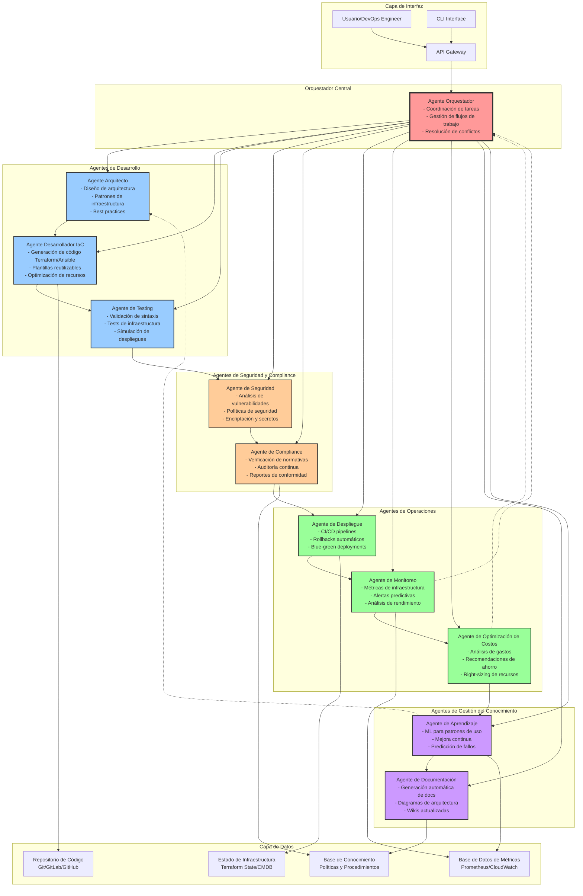
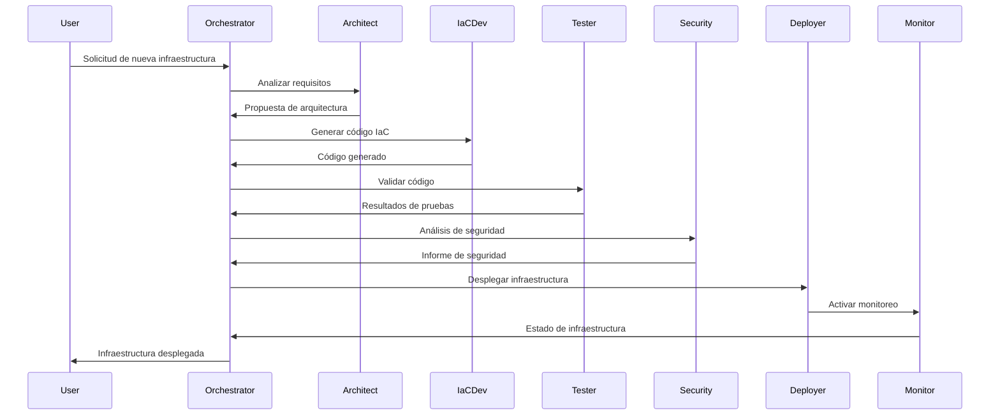

# Sistema Multi-Agente de IA para Desarrollo de Infraestructura como Código

## Diagrama de Arquitectura

## Descripción de Roles y Responsabilidades

### 1. **Agente Orquestador** 🎯
- **Rol Principal**: Coordinador central del sistema
- **Responsabilidades**:
  - Recibir y analizar solicitudes de los usuarios
  - Distribuir tareas a los agentes especializados
  - Gestionar dependencias entre tareas
  - Resolver conflictos entre recomendaciones de diferentes agentes
  - Mantener el estado global del sistema

### 2. **Agente Arquitecto** 🏗️
- **Rol Principal**: Diseñador de soluciones de infraestructura
- **Responsabilidades**:
  - Analizar requisitos y proponer arquitecturas
  - Seleccionar servicios cloud apropiados
  - Definir patrones de diseño y mejores prácticas
  - Crear diagramas de arquitectura
  - Evaluar trade-offs técnicos

### 3. **Agente Desarrollador IaC** 💻
- **Rol Principal**: Generador de código de infraestructura
- **Responsabilidades**:
  - Escribir código Terraform, CloudFormation, Ansible, etc.
  - Crear módulos reutilizables
  - Optimizar configuraciones existentes
  - Mantener versionado de código
  - Implementar parametrización dinámica

### 4. **Agente de Testing** 🧪
- **Rol Principal**: Validador de infraestructura
- **Responsabilidades**:
  - Ejecutar pruebas de sintaxis y linting
  - Realizar pruebas de integración
  - Simular despliegues en entornos de prueba
  - Validar idempotencia del código
  - Generar reportes de calidad

### 5. **Agente de Seguridad** 🔒
- **Rol Principal**: Guardian de la seguridad
- **Responsabilidades**:
  - Escanear vulnerabilidades en configuraciones
  - Implementar políticas de seguridad
  - Gestionar secretos y credenciales
  - Validar permisos y accesos
  - Monitorear amenazas de seguridad

### 6. **Agente de Compliance** 📋
- **Rol Principal**: Auditor de cumplimiento
- **Responsabilidades**:
  - Verificar cumplimiento normativo (GDPR, HIPAA, SOC2)
  - Generar reportes de auditoría
  - Mantener registros de cambios
  - Validar etiquetado de recursos
  - Asegurar gobernanza corporativa

### 7. **Agente de Despliegue** 🚀
- **Rol Principal**: Ejecutor de implementaciones
- **Responsabilidades**:
  - Gestionar pipelines CI/CD
  - Ejecutar despliegues automatizados
  - Implementar estrategias de rollback
  - Coordinar despliegues multi-región
  - Gestionar dependencias de despliegue

### 8. **Agente de Monitoreo** 📊
- **Rol Principal**: Observador del sistema
- **Responsabilidades**:
  - Recopilar métricas de infraestructura
  - Configurar alertas inteligentes
  - Analizar tendencias de rendimiento
  - Detectar anomalías
  - Predecir fallos potenciales

### 9. **Agente de Optimización de Costos** 💰
- **Rol Principal**: Optimizador financiero
- **Responsabilidades**:
  - Analizar gastos de cloud
  - Identificar recursos infrautilizados
  - Recomendar instancias reservadas
  - Sugerir arquitecturas cost-effective
  - Generar reportes de costos

### 10. **Agente de Documentación** 📚
- **Rol Principal**: Mantenedor del conocimiento
- **Responsabilidades**:
  - Generar documentación automática
  - Crear diagramas actualizados
  - Mantener wikis y runbooks
  - Documentar decisiones arquitectónicas
  - Gestionar changelog

### 11. **Agente de Aprendizaje** 🧠
- **Rol Principal**: Optimizador continuo
- **Responsabilidades**:
  - Analizar patrones históricos
  - Entrenar modelos predictivos
  - Mejorar recomendaciones del sistema
  - Identificar oportunidades de automatización
  - Evolucionar mejores prácticas

## Flujo de Trabajo Típico

## Tecnologías Sugeridas para Implementación

### Framework de Agentes
- **LangChain** o **AutoGen** para orquestación de agentes
- **OpenAI GPT-4** o **Claude** como modelos base
- **Vector databases** (Pinecone, Weaviate) para gestión de conocimiento

### Herramientas de IaC
- **Terraform** para multi-cloud
- **AWS CDK** / **Pulumi** para IaC programática
- **Ansible** para configuración
- **Helm** para Kubernetes

### Integración y APIs
- **REST APIs** para comunicación entre agentes
- **GraphQL** para consultas complejas
- **gRPC** para comunicación de alto rendimiento
- **Message queues** (RabbitMQ, Kafka) para procesamiento asíncrono

### Almacenamiento
- **Git** para versionado de código
- **S3/Blob Storage** para artefactos
- **PostgreSQL** para metadatos
- **InfluxDB/Prometheus** para métricas de series temporales

## Beneficios del Sistema

1. **Automatización Inteligente**: Reducción del 70-80% en tiempo de desarrollo de infraestructura
2. **Calidad Consistente**: Aplicación automática de mejores prácticas
3. **Seguridad Proactiva**: Detección temprana de vulnerabilidades
4. **Optimización Continua**: Reducción de costos del 30-40%
5. **Documentación Actualizada**: Siempre sincronizada con la realidad
6. **Aprendizaje Continuo**: Mejora constante basada en datos históricos

## Consideraciones de Implementación

- **Fase 1**: Implementar agentes core (Orquestador, Arquitecto, Desarrollador)
- **Fase 2**: Añadir agentes de seguridad y testing
- **Fase 3**: Integrar agentes de operaciones
- **Fase 4**: Implementar agentes de optimización y aprendizaje

Este sistema representa una evolución natural hacia la automatización completa del desarrollo de infraestructura, donde la IA no solo asiste sino que activamente participa en todas las fases del ciclo de vida de la infraestructura.